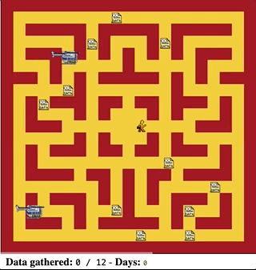

# data-takeout-game

This is a small single-player browser game I made just for fun, started while working in the domain of online Privacy around the time of [GDPR](https://en.wikipedia.org/wiki/General_Data_Protection_Regulation).

It is about performing data take-out - _the manual way_.
Personal data are scattered everywhere. Gather them all without undue delay and watch out for the privacy auditors in their helicopters.



## Game Controls

```
            ┌──┐      ┌──┐
   move     │ P│pause │ R│restart
   ┌──┐     └──┘      └──┘
   │ W│
┌──┼──┼──┐  ┌─────────────┐
│ A│ S│ D│  │    space    │ start
└──┴──┴──┘  └─────────────┘

 ┌──┐                ┌──┐
 │ M│ debug mode     │ v│ victory
 └──┘                └──┘
(hold)    ┌──┐
          │ G│ log game status
          └──┘
```

## Implementation

This game was built from the ground up using just Typescript.

I decided not to use any dependency. This forced me to reason about rendering, animations, collision detection, pathfinding and all the basics that a game engine would normally solve for you.

Once the game logic was in place, I wrapped the UI in a Web Component using Lit. This can be easily replaceable with your framework of choice, or even with no framework.

## Features

### Preys & Hunters

The game defines the concept of Prey = fleeing from you, and Hunter = chasing you.

Example: a pray


The **fleeing logic** takes into account the player position. A pray moves towards the direction that will bring them further from the player. If the best thing to do is not moving the prey will stop, waiting for the player to make a move.

This strategy made preys impossible to catch, so some of them are a bit slower, while some are a bit dumber (they have a small chance of not choosing the best route). This diversity also helps preys to spread up on the maze, instead of clustering all together.

The **hunting logic** is simpler, since hunters are flying and can ignore walls. They will constantly fly toward the player.
Over time this causes them to cluster and move as one. This could be improved.

### Debug mode

This feature shows several visual aids, used during the developent and makes logs very verbose.


Example of these visual aids are:

- characters id and current route
- each cell shows min distance from player
- highlights next decision points (forks or curves)

## Known Limitations

This game relies on keyboard input, and is therefore not mobile friendly.
It would work by adding some touch input overlay.

It is also probably not working on some browsers: I targeted mainly Chrome and Firefox.

And finally **performance**: this game is not really optimized. You get the idea ;)

## Credits

The [helicopter sprite](img/authority.png) is based on this [sprite](https://www.pokecommunity.com/showthread.php?t=384499) by [godofsalad](https://www.pokecommunity.com/member.php?u=642968)

The start screens were created in collaboration with [nowiknowicki](https://www.behance.net/nowiknowicki)

All pixel art for the sprites was created using [Piskel](https://www.piskelapp.com/)
