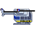
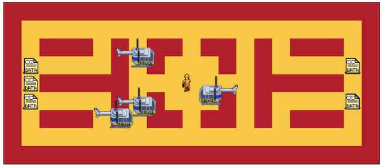

# Data Takeout: the game

This is a small single-player browser game I made just for fun, started while working in the domain of online Privacy around the time of [GDPR](https://en.wikipedia.org/wiki/General_Data_Protection_Regulation).

It is about performing data take-out - _the manual way_.
Personal data are scattered everywhere. Gather them all without undue delay and watch out for the privacy auditors in their helicopters.

## Game

🕹 Play on 👉 https://dangrasso.github.io/data-takeout-game/


⌨️ Controls:
```
                ┌───┐     ┌───┐     ┌───┐
     run        │ R │     │ P │     │ M │ (hold) debug mode
    ┌───┐       └───┘     └───┘     └───┘
    │ W │      restart    pause          ┌───┐
┌───┼───┼───┐                            │ G │ log game info
│ A │ S │ D │                            └───┘
└───┴───┴───┘  ┌─────────────────┐             ┌───┐
               │      space      │ start       │ v │ victory
               └─────────────────┘             └───┘
```

☝️ Controls:
 * swipe (and hold) -> move
 * tap -> start
 * tap (2-finger) -> pause

## Implementation

This game was built from the ground up using just Typescript.

I decided not to use any dependency. This forced me to reason about rendering, animations, collision detection, pathfinding and all the basics that a game engine would normally solve for you.

Once the game logic was in place, I wrapped the UI in a Web Component using Lit. This can be easily replaceable with your framework of choice, or even with no framework.

### Run locally

After installing node (>= 14.x) and the dependencies (`npm i`):
```
npm run build && npm run serve
```
The dev server will be generally started on http://localhost:8000/

You can also automatically rebuild on changes with `npm run build:watch`

### CI & Deployment

This repo is deployed to Github Pages automatically via Github Actions on every commit to `main`. For details, check out the workflow [build-and-deploy](.github/workflows/build-and-deploy.yml). 

Only the relevant files are published, use `npm run docs` to generate the equivalent bundle locally.

Other tools used are:
 - `npm run format` (manual) runs prettier to apply consistent formatting
 - `npm run lint` runs eslint and a linter for Lit components
 - `npm run analyze` scans for web components and generates a manifest

## Features

### Characters

The game is based on these types of characters:
 - Preys: fleeing from you
 - Hunters: chasing you

Oh, and there you are, somewhat in between: the Player!

>  _Ready to collect some data!_
 
#### Preys

>   _Hello, I'm a prey!_

The **fleeing logic** takes into account the player position. A prey moves towards the direction that will bring them furthest from the player. If the best thing to do is not moving the prey will stop, waiting for the player to make a move.

This strategy made preys impossible to catch, so I made them a bit slower than the player and a bit dumber (they have a 25% chance of not choosing the best route when they make a move). This randomness also helps preys to spread up on the maze, instead of clustering all together.

Preys also get scared when the player is close to them. Their speed reflects how scared or safe they feel.

#### Hunters

>   _Beware, I'm a hunter!_

The **hunting logic** is not affected by walls, since hunters are flying. 

Hunters are slow but smart and act as a pack:
- they select an "alpha" hunter (the closest) that'll fly towards the player directly
- another hunter will try to anticipate the player on its current escape route
- all remaining hunters will try to surround the player blocking all other escape routes

### Maze

The maze is very simple, it has walls and floor tiles.
The cool part is that it is completely generated on the game start based on a [string input](src/config.ts).

This is also when, for each floor tile, the shortest distance to each other tile is pre-computed, using a BFS algorithm, as well as the next "decision points" (forks and curves) in each direction.


**Example:** a custom maze input
```
+-------------------+
|                   |
| ### # ## ## # ### |
|     # #   # #     |
| #####       ##### |
|     # #   # #     |
| ### # ## ## # ### |
|                   |
+-------------------+
```
The resulting maze:



### Debug mode

This feature shows several visual aids, used during the developent, and makes logs quite verbose.
Example of these visual aids are:
 - characters id, bounding box, line to their current movement target
 - maze distance from player on every cell
 - next "decision points" from player, like forks or curves


## Known Limitations

This game is mostly mobile friendly, but some features rely on keyboard input (like restarting & debug mode).

It is also probably not working on some browsers: I targeted mainly Chrome and Firefox.

And finally **performance**: this game is not really optimized. You get the idea ;)

## Credits

The idea of the game and its core mechanics, especially on how to optimize prey movements, were the result of great teamwork and whiteboard sessions with [bjornarg](https://github.com/bjornarg).

The start screens were created in collaboration with [nowiknowicki](https://www.behance.net/nowiknowicki)

The [helicopter sprite](img/sprites/helicopter.png) is based on this [sprite](https://www.pokecommunity.com/showthread.php?t=384499) by [godofsalad](https://www.pokecommunity.com/member.php?u=642968)

Kudos to [codeman38](http://www.zone38.net) for the pixelated font "Press Start".

All pixel art for the sprites was created using [Piskel](https://www.piskelapp.com/)
